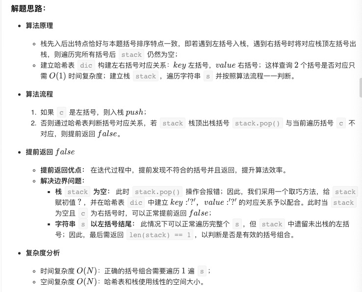

# 题目

给定一个只包括 '('，')'，'{'，'}'，'['，']' 的字符串，判断字符串是否有效。

有效字符串需满足：

> 1.左括号必须用相同类型的右括号闭合。
> 2.左括号必须以正确的顺序闭合。

注意空字符串可被认为是有效字符串。

示例 1:

> 输入: "()"
> 输出: true

示例 2:

> 输入: "()[]{}"
> 输出: true

示例 3:

> 输入: "(]"
> 输出: false

示例 4:

> 输入: "([)]"
> 输出: false

示例 5:

> 输入: "{[]}"
> 输出: true

## 解题思路：



​	c方法源代码

```c
//map 的简单实现
struct hash_data{
    int key;
    int data;
    struct hash_data * next;
};

 struct hash_table
{
    struct hash_data ** head; //数组
    int hash_width;
};

///初始化
int hash_init(struct hash_table * table, int width){
    if(width<=0)
        return -1;
    struct hash_data **tmp = malloc(sizeof(struct hash_data *)*width);
    table->head = tmp;
    memset(table->head, 0, width * sizeof(struct hash_data *));
    if(table->head==NULL)
        return -1;
    table->hash_width = width;
    return 0;
}

///释放
void hash_free(struct hash_table table){
    if(table.head!=NULL){
        for (int i=0; i<table.hash_width; i++) {
            struct hash_data* element_head= table.head[i];
            while (element_head !=NULL) {
                struct hash_data* temp =element_head;
                element_head = element_head->next;
                free(temp);
            }
        }
        free(table.head);
        table.head = NULL;
    }
    table.hash_width = 0;
}

int hash_addr(struct hash_table table,int key){
    int addr =abs(key) % table.hash_width;
    return addr;
}

///增加
int hash_insert(struct hash_table table,int key, int value){
    struct hash_data * tmp = malloc(sizeof(struct hash_data));
    if(tmp == NULL)
        return -1;
    tmp->key = key;
    tmp->data = value;
    int k = hash_addr(table,key);
    tmp->next =table.head[k];
    table.head[k]=tmp;
    return 0;
}

///查找
struct hash_data* hash_find(struct hash_table table, int key){
    int k = hash_addr(table,key);
    struct hash_data* element_head=table.head[k];
    while (element_head !=NULL) {
        if ( element_head->key == key) {
            return element_head;
        }
        element_head = element_head->next;
    }
    return NULL;
}
///依赖map实现
int* twoSum(int* nums, int numsSize, int target, int* returnSize){
    int* res = (int *)malloc(sizeof(int) * 2);
    * returnSize=0;
    struct hash_table table;
    hash_init(&table, 100);
    for (int i=0; i<numsSize; i++) {
        hash_insert(table,nums[i] ,i);
    }
    
    for(int i = 0; i < numsSize; i++)
    {
        int value = target - nums[i];
        struct hash_data* data=  hash_find(table, value);
        if (data !=NULL && data->data != i) {
            res[1]=i;
            res[0]=data->data;
            * returnSize=2;
        }
    }
    hash_free(table);
    return res;
}

bool isValid(char * s){
    struct hash_table table;
    hash_init(&table, 100);
    hash_insert(table,'{' ,'}');
    hash_insert(table,'[' ,']');
    hash_insert(table,'(' ,')');
    long l= strlen(s);
    char* res = (char *)malloc(l+1);
    int index=0;
    bool result=true;
    for (int i=0; i<l; i++) {
        char cha = s[i];
        ///如果是{ [ ( ,就push
        if (hash_find(table,cha) != NULL) {
            res[index]=cha;
            index++;
        }else {
            ///如果是}]) 就需要匹配前面的字符串
            index--;
            if (index<0 || cha != hash_find(table,res[index])->data){
                result = false;
                break;
            }
        }
    }
    if (index!=0) {
        result = false;
    }
    free(res);
    hash_free(table);
    return  result;
}

```

[github地址](https://github.com/NPOpenSource/leedCode)

​	

